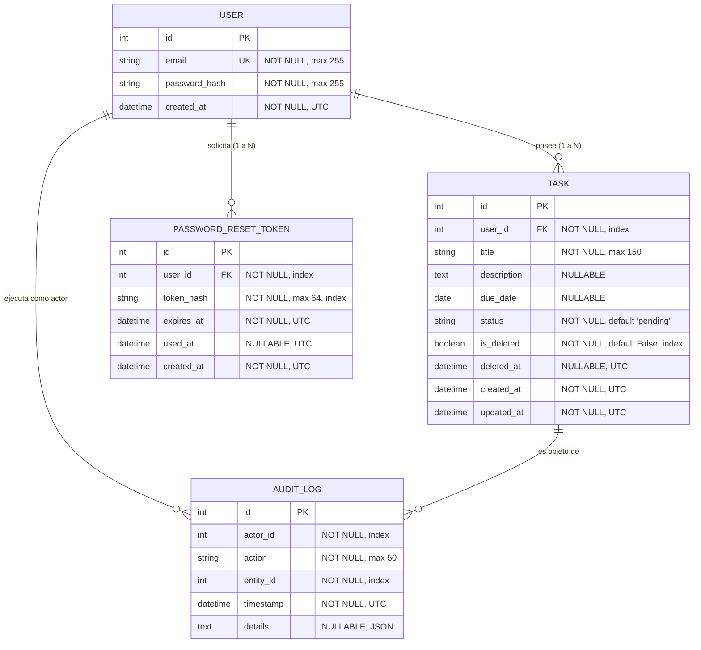
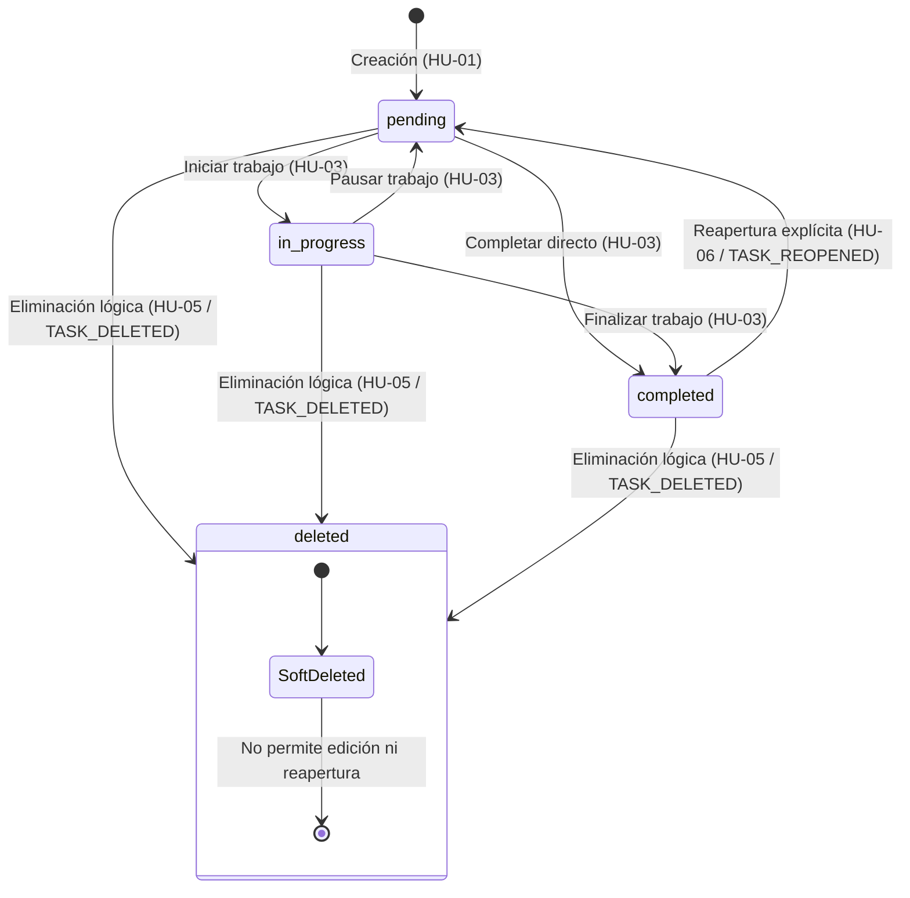

# Data Model: 002-task-closure-recovery

**Feature**: 002-task-closure-recovery  
**Date**: 2026-10-01  
**ORM**: SQLAlchemy  

---

## 1. Diagrama Entidad-Relación

---

## 2. Entidades y Esquemas Detallados

### 2.1. Entidad `Task` (Extendida para Soft Delete)
Se mantiene la compatibilidad absoluta con el modelo del Incremento 1, agregando dos columnas para trazabilidad de eliminación lógica sin borrado físico:

| Campo | Tipo | Restricciones | Descripción |
|---|---|---|---|
| `id` | `Integer` | PK, autoincrement | Identificador único de la tarea |
| `user_id` | `Integer` | FK (`users.id`), Not Null, Index | Propietario de la tarea |
| `title` | `String(150)` | Not Null | Título de la tarea |
| `description` | `Text` | Nullable | Detalle descriptivo de la tarea |
| `due_date` | `Date` | Nullable | Fecha límite asignada |
| `status` | `String(20)` | Not Null, Default `'pending'` | Estado (`pending`, `in_progress`, `completed`) |
| `is_deleted` | `Boolean` | Not Null, Default `False`, Index | Indicador de eliminación lógica (soft delete) |
| `deleted_at` | `DateTime` | Nullable, UTC | Marca de tiempo exacta del borrado lógico |
| `created_at` | `DateTime` | Not Null, Default UTC | Fecha de creación de la tarea |
| `updated_at` | `DateTime` | Not Null, Default UTC, onupdate UTC | Fecha de última actualización |

**Reglas de negocio (`TaskService`)**:
- En consultas de listado regular (`get_user_tasks`): filtrar `is_deleted == False`.
- Al eliminar (`delete_task`): verificar que `is_deleted == False`. Si es `True`, arrojar error `TaskAlreadyDeletedError`. Si es `False`, actualizar `is_deleted = True`, `deleted_at = now_utc()`.
- Al editar (`update_task`): verificar que `is_deleted == False`. Las tareas eliminadas no son editables.

---

### 2.2. Entidad `PasswordResetToken` (Nueva)
Representa un token emitido para el flujo de restablecimiento de contraseña (HU-14).

| Campo | Tipo | Restricciones | Descripción |
|---|---|---|---|
| `id` | `Integer` | PK, autoincrement | Identificador único del registro de token |
| `user_id` | `Integer` | FK (`users.id`), Not Null, Index | Usuario al que pertenece el token |
| `token_hash` | `String(64)` | Not Null, Index | Hash SHA-256 del token entregado al usuario |
| `expires_at` | `DateTime` | Not Null, UTC | Momento exacto de expiración (creación + 30 min) |
| `used_at` | `DateTime` | Nullable, UTC | Momento en el que fue consumido (nulo si no se ha usado) |
| `created_at` | `DateTime` | Not Null, Default UTC | Momento de generación del token |

**Reglas de validación y seguridad (`AuthService` / `UserService`)**:
- El token en texto plano nunca se guarda en base de datos.
- Un token es válido si y solo si: `used_at IS NULL` y `now_utc() < expires_at`.
- Al confirmar el restablecimiento: se actualiza `user.password_hash` y se asigna `token.used_at = now_utc()` en una misma transacción ACID.

---

### 2.3. Entidad `AuditLog` (Nuevas Acciones)

Se reutiliza la tabla inmutable `audit_logs` del Incremento 1, incorporando los siguientes identificadores formales de acción:

| Acción (`action`) | Entidad (`entity_id`) | Descripción del Evento |
|---|---|---|
| `TASK_DELETED` | `task.id` | Tarea eliminada lógicamente por su propietario |
| `TASK_REOPENED` | `task.id` | Tarea completada devuelta explícitamente a estado pendiente |
| `PASSWORD_RESET_REQUESTED` | `user.id` | Solicitud de restablecimiento generada para una cuenta válida |
| `PASSWORD_RESET_COMPLETED` | `user.id` | Restablecimiento de contraseña consumado con éxito |

---

## 3. Máquina de Estados de `Task` para el Incremento 2

