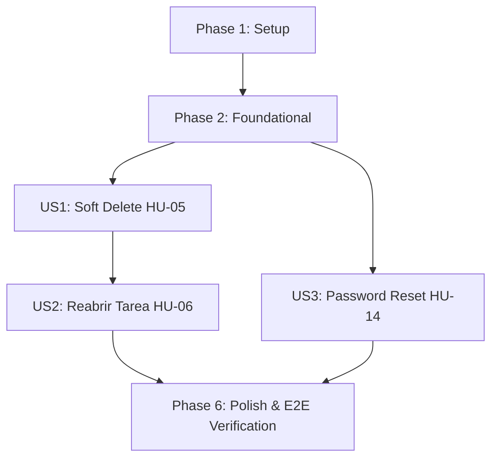

# Tasks: 002-task-closure-recovery

**Feature**: 002-task-closure-recovery (Cierre del ciclo de tareas y recuperación de acceso)  
**Spec**: [spec.md](spec.md) | **Plan**: [plan.md](plan.md)  
**Date**: 2026-10-01  
**Status**: Ready for Implementation  

---

## Phase 1: Setup (Shared Infrastructure)

**Purpose**: Sincronización del entorno, ampliación de constantes de auditoría y soporte base para nuevos eventos.

- [ ] T001 Synchronize development environment and verify baseline test suite in `tests/` with `pytest`
- [ ] T002 [P] Register new audit action constants (`TASK_DELETED`, `TASK_REOPENED`, `PASSWORD_RESET_REQUESTED`, `PASSWORD_RESET_COMPLETED`) in `src/taskcontrol/models/audit.py` per `specs/002-task-closure-recovery/data-model.md`
- [ ] T003 [P] Extend `AuditService` in `src/taskcontrol/services/audit_service.py` supporting anonymous/system actor (defaulting to `actor_id=0` when actor is unauthenticated) and registering new audit action constants

---

## Phase 2: Foundational (Blocking Prerequisites)

**Purpose**: Infraestructura de datos bloqueante: extensión de `Task` para soft delete, nuevo modelo `PasswordResetToken`, migraciones de base de datos y excepciones de dominio.

**⚠️ CRITICAL**: Ninguna historia de usuario puede implementarse hasta completar esta fase.

- [ ] T004 Extend `Task` model in `src/taskcontrol/models/task.py` with columns `is_deleted (Boolean, Not Null, default False, index)` and `deleted_at (DateTime, Nullable, UTC)` per `specs/002-task-closure-recovery/data-model.md`
- [ ] T005 [P] Create `PasswordResetToken` model in `src/taskcontrol/models/password_reset.py` with columns `id (PK, Integer)`, `user_id (FK users.id, Not Null, index)`, `token_hash (String(64), Not Null, index)`, `expires_at (DateTime, Not Null, UTC)`, `used_at (DateTime, Nullable, UTC)`, `created_at (DateTime, Not Null, default UTC)` per `specs/002-task-closure-recovery/data-model.md`
- [ ] T006 Expose `PasswordResetToken` in `src/taskcontrol/models/__init__.py` and generate database migration script in `migrations/versions/` executing upgrade per Principle VI
- [ ] T007 [P] Define domain exceptions (`TaskNotFoundError`, `TaskAlreadyDeletedError`, `InvalidTaskStateTransitionError`, `InvalidResetTokenError`) in `src/taskcontrol/services/task_service.py` and `src/taskcontrol/services/user_service.py`

**Checkpoint**: Base de datos y modelos listos con compatibilidad retrospectiva. Las historias de usuario pueden comenzar.

---

## Phase 3: User Story 1 - Eliminación Lógica de Tareas (HU-05) (Priority: P1) 🎯 MVP Core

**Goal**: Permitir a un usuario autenticado eliminar lógicamente una tarea propia (*soft delete*), excluyéndola del listado habitual sin borrar el registro físico ni perder el historial de auditoría.

**Independent Test**: Crear una tarea activa, solicitar su eliminación con sesión autenticada; verificar que desaparezca del listado por defecto (`GET /tasks`), que permanezca en la tabla `tasks` con `is_deleted=True` y que exista un registro `TASK_DELETED` en `AuditLog`.

### Tests for User Story 1 (Test-First bloqueante - Principio IV) ⚠️
> **NOTA: Escribir estas pruebas primero y verificar que FALLAN antes de implementar el código**

- [ ] T008 [P] [US1] Write failing service tests for soft delete in `tests/services/test_task_service.py` (`test_soft_delete_task_marks_deleted_and_sets_timestamp`, `test_soft_delete_preserves_task_in_database_and_audit_history`, `test_deleted_task_excluded_from_default_listing`, `test_cannot_delete_already_deleted_task`, `test_cannot_edit_deleted_task`)
- [ ] T009 [P] [US1] Write failing functional tests for task deletion routes in `tests/functional/test_task_routes.py` (`POST /tasks/<id>/delete` returns 200 JSON / 302 HTML on success, 401 without session, 404 for other user's task or non-existent task, 400/409 on already deleted task per contract)

### Implementation for User Story 1
- [ ] T010 [US1] Update `get_user_tasks` and `get_task_by_id` in `src/taskcontrol/services/task_service.py` to filter by `is_deleted=False` by default, preserving Increment 1 contract
- [ ] T011 [US1] Implement `delete_task(task_id, user_id)` in `src/taskcontrol/services/task_service.py` setting `is_deleted=True`, `deleted_at=now_utc()`, raising `TaskAlreadyDeletedError` if already deleted, and logging `TASK_DELETED` (make service tests pass)
- [ ] T012 [US1] Implement `POST /tasks/<int:task_id>/delete` route handler in `src/taskcontrol/routes/tasks.py` with `@login_required` per `specs/002-task-closure-recovery/contracts/task-contracts.md` (make functional tests pass)
- [ ] T013 [US1] Add "Eliminar" action button with confirmation in `src/taskcontrol/templates/tasks/index.html`

**Checkpoint**: User Story 1 (HU-05) completamente operativa y verificada con pruebas automatizadas.

---

## Phase 4: User Story 2 - Reapertura de Tareas Completadas (HU-06) (Priority: P1)

**Goal**: Permitir a un usuario autenticado reabrir una tarea previamente marcada como completada, devolviéndola al estado activo inicial `pending` y registrando el evento específico `TASK_REOPENED` en el log de auditoría.

**Independent Test**: Marcar una tarea como completada, ejecutar la reapertura y verificar que el estado retorne a `pending` y que en `AuditLog` aparezca el evento diferenciado `TASK_REOPENED` con los detalles de la transición.

### Tests for User Story 2 (Test-First bloqueante - Principio IV) ⚠️
- [ ] T014 [P] [US2] Write failing service tests for task reopening in `tests/services/test_task_service.py` (`test_reopen_completed_task_success`, `test_reopen_task_generates_specific_task_reopened_audit_log`, `test_cannot_reopen_non_completed_or_deleted_task`)
- [ ] T015 [P] [US2] Write failing functional tests for task reopening route in `tests/functional/test_task_routes.py` (`POST /tasks/<id>/reopen` returns 200 JSON / 302 HTML on success, 400 if status is not `completed` or if task is deleted, 404 for unauthorized or non-existent task, 401 without session)

### Implementation for User Story 2
- [ ] T016 [US2] Implement `reopen_task(task_id, user_id)` in `src/taskcontrol/services/task_service.py` validating that `task.status == 'completed'` and `task.is_deleted is False`, updating status to `'pending'`, and invoking `audit_service.log_event` with action `TASK_REOPENED`
- [ ] T017 [US2] Implement `POST /tasks/<int:task_id>/reopen` route handler in `src/taskcontrol/routes/tasks.py` with `@login_required` per `specs/002-task-closure-recovery/contracts/task-contracts.md`
- [ ] T018 [US2] Add "Reabrir" action button in `src/taskcontrol/templates/tasks/index.html` displayed conditionally for tasks in `completed` status

**Checkpoint**: User Story 2 (HU-06) completamente funcional e integrada con el ciclo de vida de tareas.

---

## Phase 5: User Story 3 - Recuperación Segura de Contraseña (HU-14) (Priority: P2)

**Goal**: Permitir a los usuarios restablecer su contraseña mediante solicitud por correo electrónico con respuesta neutra (previniendo enumeración de cuentas), generación de tokens temporales de uso único protegidos con hash SHA-256 e invalidación atómica al actualizar la clave.

**Independent Test**: Solicitar restablecimiento con correo registrado e inexistente (ambos retornan mensaje idéntico neutro 200 OK); utilizar el enlace/token para ingresar nueva contraseña (mínimo 8 caracteres); verificar que el login funcione con la nueva clave y que el token quede invalidado para cualquier reintento o tras 30 minutos.

### Tests for User Story 3 (Test-First bloqueante - Principio IV) ⚠️
- [ ] T019 [P] [US3] Write failing service tests for password reset in `tests/services/test_user_service.py` (`test_password_reset_request_neutral_response_existing_and_non_existing_email`, `test_password_reset_token_hashed_in_database`, `test_password_reset_success_updates_password_and_invalidates_token`, `test_cannot_reuse_already_used_reset_token`, `test_cannot_use_expired_reset_token`)
- [ ] T020 [P] [US3] Write failing functional tests for password reset routes in `tests/functional/test_auth_routes.py` (`POST /auth/forgot-password` returns 200 with neutral message, `GET /auth/reset-password/<token>` renders form for valid token and 400 for expired/used token, `POST /auth/reset-password/<token>` updates password, invalidates token and redirects to login)

### Implementation for User Story 3
- [ ] T021 [US3] Implement cryptographic token generation and SHA-256 hashing helpers (`secrets.token_urlsafe(32)`, `hashlib.sha256`) in `src/taskcontrol/services/user_service.py`
- [ ] T022 [US3] Implement `request_password_reset(email)` in `src/taskcontrol/services/user_service.py` normalizing email, returning `True` neutrally for existing and non-existing accounts, invalidating prior tokens, persisting SHA-256 token hash with 30-min expiration, emitting simulation log to `app.logger.info`, and logging `PASSWORD_RESET_REQUESTED`
- [ ] T023 [US3] Implement `verify_reset_token(raw_token)` and `reset_password(raw_token, new_password)` in `src/taskcontrol/services/user_service.py` validating 8-character minimum, updating `user.password_hash`, atomically setting `token.used_at = now_utc()`, and logging `PASSWORD_RESET_COMPLETED`
- [ ] T024 [US3] Implement forgot-password and reset-password route handlers (`GET /auth/forgot-password`, `POST /auth/forgot-password`, `GET /auth/reset-password/<token>`, `POST /auth/reset-password/<token>`) in `src/taskcontrol/routes/auth.py` per `specs/002-task-closure-recovery/contracts/auth-contracts.md`
- [ ] T025 [P] [US3] Create forgot password template in `src/taskcontrol/templates/auth/forgot_password.html` with email submission form and link to login
- [ ] T026 [P] [US3] Create reset password template in `src/taskcontrol/templates/auth/reset_password.html` with new password fields, confirmation, and error alerts
- [ ] T027 [US3] Add "Olvidé mi contraseña" link in `src/taskcontrol/templates/auth/login.html` leading to `/auth/forgot-password`

**Checkpoint**: Flujo de recuperación de contraseñas (HU-14) completado y seguro.

---

## Phase 6: Polish & Cross-Cutting Concerns

**Purpose**: Verificación integral de calidad, scripts cliente y suite completa sin regresiones.

- [ ] T028 [P] Enhance client-side interaction script in `src/taskcontrol/static/js/main.js` adding confirmation modal/prompt for task deletion and reopen
- [ ] T029 Execute full test suite `pytest -v` across all service and functional tests ensuring 100% pass rate
- [ ] T030 Validate end-to-end user workflows following `specs/002-task-closure-recovery/quickstart.md` ensuring zero regression against Increment 1 features

---

## Dependencies & Execution Order

### Phase Dependencies

- **Setup (Phase 1)**: Sin dependencias, arranca de inmediato.
- **Foundational (Phase 2)**: Depende de Phase 1. **BLOQUEA** todas las historias de usuario.
- **User Story 1 (Phase 3 - HU-05)**: Depende de Foundational (Phase 2).
- **User Story 2 (Phase 4 - HU-06)**: Depende de Foundational (Phase 2) y US1 (requiere modelos de tareas y soft delete activos).
- **User Story 3 (Phase 5 - HU-14)**: Depende de Foundational (Phase 2). Puede ejecutarse en paralelo con US1/US2 a nivel de servicios y rutas.
- **Polish (Phase 6)**: Depende de la conclusión de US1, US2 y US3.

### User Story Execution Graph

### Reglas de Ejecución Dentro de Cada Historia
1. Escribir pruebas unitarias y de servicio (en rojo) antes de implementar lógica de dominio.
2. Escribir pruebas funcionales de endpoints (en rojo) antes de crear rutas HTTP.
3. Servicios de dominio antes de blueprints HTTP.
4. Blueprints HTTP antes de plantillas Jinja2 / frontend.

---

## Parallel Opportunities

- **Setup Tasks**: T002 y T003 pueden ejecutarse en paralelo.
- **Foundational Tasks**: T005 y T007 pueden ejecutarse en paralelo con T004.
- **Pruebas por Historia**: T008 y T009 (US1), T014 y T015 (US2), T019 y T020 (US3) pueden escribirse en paralelo.
- **Plantillas Frontend**: T025 y T026 pueden diseñarse en paralelo.

---

## Implementation Strategy

### MVP First (User Story 1: Soft Delete)
1. Completar Setup (Fase 1) y Foundational (Fase 2: modelos y migraciones).
2. Implementar US1 (Eliminación lógica HU-05) con ciclo test-first.
3. **Validar MVP del Incremento 2**: Eliminar tareas sin borrado físico verificado en base de datos y auditoría.

### Entrega Incremental
1. Añadir US2 (Reapertura HU-06) completando el ciclo de vida de tareas.
2. Añadir US3 (Recuperación de contraseña HU-14) completando el acceso y autenticación.
3. Ejecutar Fase 6 (Polish & E2E) con `pytest -v` garantizando cero regresión sobre las 29 pruebas del Incremento 1.
