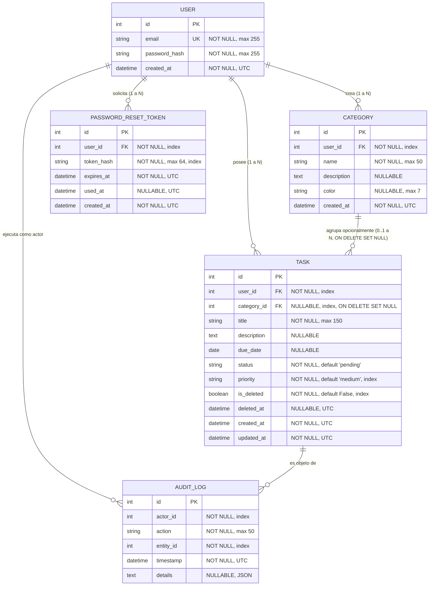

# Data Model: 003-task-organization-priority

**Feature**: 003-task-organization-priority  
**Date**: 2026-10-01  
**ORM**: SQLAlchemy  

---

## 1. Diagrama Entidad-Relación

---

## 2. Entidades y Esquemas Detallados

### 2.1. Entidad `Category` (Nueva)
Representa un proyecto, ámbito o etiqueta temática creada por un usuario para organizar sus tareas.

| Campo | Tipo | Restricciones | Descripción |
|---|---|---|---|
| `id` | `Integer` | PK, autoincrement | Identificador único de la categoría |
| `user_id` | `Integer` | FK (`users.id`), Not Null, Index | Propietario de la categoría |
| `name` | `String(50)` | Not Null | Nombre de la categoría (ej. "Trabajo", "Personal") |
| `description` | `Text` | Nullable | Descripción o notas sobre la categoría |
| `color` | `String(7)` | Nullable, formato estricto `^#[0-9A-Fa-f]{6}$` si se provee | Código hexadecimal de color (ej. `#2563EB`) |
| `created_at` | `DateTime` | Not Null, Default UTC | Fecha y hora de creación |

**Restricciones de Integridad y Validación**:
- `UniqueConstraint('user_id', 'name', name='uq_user_category_name')`: Garantiza que un usuario no pueda registrar dos categorías con el mismo nombre. Usuarios diferentes sí pueden compartir nombres idénticos.
- `color`, si se provee, se valida contra `^#[0-9A-Fa-f]{6}$`; un valor que no cumpla el formato se rechaza con `400 Bad Request` (ver spec Clarifications, Session 2026-10-06, Q3).
- Al eliminar una categoría: **No se permite el borrado en cascada**. Las tareas vinculadas se desasocian fijando `category_id = NULL`.

---

### 2.2. Entidad `Task` (Extendida para Prioridad y Categoría)

Se amplía el modelo existente con dos nuevos atributos de persistencia y una propiedad calculada en backend:

| Campo | Tipo | Restricciones | Descripción |
|---|---|---|---|
| `id` | `Integer` | PK, autoincrement | Identificador único de la tarea |
| `user_id` | `Integer` | FK (`users.id`), Not Null, Index | Propietario de la tarea |
| `category_id` | `Integer` | FK (`categories.id`, `ondelete='SET NULL'`), Nullable, Index | Categoría opcional asignada |
| `title` | `String(150)` | Not Null | Título de la tarea |
| `description` | `Text` | Nullable | Detalle extendido |
| `due_date` | `Date` | Nullable | Fecha límite asignada |
| `status` | `String(20)` | Not Null, Default `'pending'` | Estado (`pending`, `in_progress`, `completed`) |
| `priority` | `String(20)` | Not Null, Default `'medium'`, Index | Nivel de prioridad (`high`, `medium`, `low`) |
| `is_deleted` | `Boolean` | Not Null, Default `False`, Index | Indicador de eliminación lógica (Incremento 2) |
| `deleted_at` | `DateTime` | Nullable, UTC | Marca de tiempo de borrado lógico (Incremento 2) |
| `created_at` | `DateTime` | Not Null, Default UTC | Creación |
| `updated_at` | `DateTime` | Not Null, Default UTC | Última modificación |

**Propiedad Computada en Backend (No Persistida)**:
- `is_overdue -> bool`: Retorna `True` si y solo si:
  `self.due_date is not None and self.due_date < current_date_utc and self.status != 'completed' and not self.is_deleted`.

---

### 2.3. Nuevas Acciones en `AuditLog`

| Acción (`action`) | Entidad (`entity_id`) | Descripción del Evento |
|---|---|---|
| `CATEGORY_CREATED` | `category.id` | Creación de una categoría con nombre y color |
| `CATEGORY_UPDATED` | `category.id` | Edición del nombre o metadatos de la categoría |
| `CATEGORY_DELETED` | `category.id` | Eliminación de categoría y desvinculación de tareas |
| `TASK_UPDATED` | `task.id` | Modificación de prioridad o reasignación de categoría |
