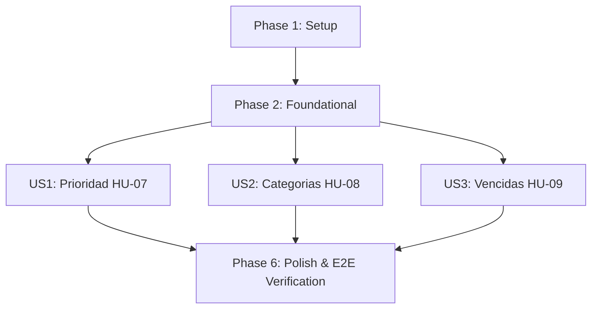

# Tasks: 003-task-organization-priority

**Feature**: 003-task-organization-priority (Organización y priorización de tareas)
**Spec**: [spec.md](spec.md) | **Plan**: [plan.md](plan.md)
**Date**: 2026-10-06 (revisado tras `/speckit-analyze`)
**Status**: Ready for Implementation

---

## Phase 1: Setup (Shared Infrastructure)

**Purpose**: Sincronización del entorno y ampliación de constantes de auditoría para las nuevas acciones de categorías.

- [X] T001 Synchronize development environment and verify baseline test suite in `tests/` with `pytest` (debe mostrar las 58 pruebas de los Incrementos 1 y 2 en verde)
- [X] T002 [P] Register new audit action constants (`CATEGORY_CREATED`, `CATEGORY_UPDATED`, `CATEGORY_DELETED`) in `src/taskcontrol/models/audit.py` per `specs/003-task-organization-priority/data-model.md`

---

## Phase 2: Foundational (Blocking Prerequisites)

**Purpose**: Infraestructura de datos bloqueante: extensión de `Task` para prioridad y categoría, nuevo modelo `Category`, migraciones y excepciones de dominio.

**⚠️ CRITICAL**: Ninguna historia de usuario puede implementarse hasta completar esta fase.

- [X] T003 Extend `Task` model in `src/taskcontrol/models/task.py` with columns `priority (String(20), Not Null, default 'medium', index)` and `category_id (FK categories.id, Nullable, index, ondelete='SET NULL')` per `specs/003-task-organization-priority/data-model.md`
- [X] T004 [P] Create `Category` model in `src/taskcontrol/models/category.py` with columns `id (PK, Integer)`, `user_id (FK users.id, Not Null, index)`, `name (String(50), Not Null)`, `description (Text, Nullable)`, `color (String(7), Nullable, formato estricto ^#[0-9A-Fa-f]{6}$ si se provee)`, `created_at (DateTime, Not Null, default UTC)`, y `UniqueConstraint('user_id', 'name')` per `specs/003-task-organization-priority/data-model.md`
- [X] T005 Expose `Category` in `src/taskcontrol/models/__init__.py`, register `category = db.relationship(...)` backref en `Task`, y generar + aplicar migración en `migrations/versions/` con `server_default='medium'` para `priority` (compatibilidad retroactiva con tareas de Incrementos 1-2) per Principle VI
- [X] T006 [P] Define domain exceptions (`InvalidPriorityError`, `DuplicateCategoryNameError`, `CategoryNotFoundError`, `InvalidCategoryColorError`) in `src/taskcontrol/services/task_service.py` y `src/taskcontrol/services/category_service.py`

**Checkpoint**: Base de datos y modelos listos con compatibilidad retrospectiva. Las historias de usuario pueden comenzar.

---

## Phase 3: User Story 1 - Prioridad de Tareas y Ordenamiento (HU-07) (Priority: P1) 🎯 MVP Core

**Goal**: Permitir a un usuario autenticado asignar prioridad a sus tareas (en creación o edición), y ordenar su listado respetando la jerarquía alta → media → baja con desempate por `due_date` ascendente.

**Independent Test**: Crear una tarea sin prioridad explícita y verificar que quede en `medium`; crear otra indicando prioridad directamente; cambiar la prioridad de una tarea existente; crear varias tareas con distintas prioridades y fechas, ordenar por `priority_desc` y verificar el orden jerárquico con desempate correcto.

### Tests for User Story 1 (Test-First bloqueante - Principio IV) ⚠️
> **NOTA: Escribir estas pruebas primero y verificar que FALLAN antes de implementar el código**

- [X] T007 [P] [US1] Write failing service tests in `tests/services/test_task_service.py` (`test_task_priority_default_is_medium`, `test_create_task_with_explicit_priority`, `test_create_task_invalid_priority_rejected`, `test_update_task_priority_success`, `test_update_task_priority_invalid_value_rejected`, `test_cannot_update_priority_of_other_users_task`, `test_tasks_sorted_by_priority_descending_high_medium_low`, `test_same_priority_tasks_sorted_by_due_date_ascending_nulls_last`, `test_tasks_sorted_by_priority_respects_status_filters`)
- [X] T008 [P] [US1] Write failing functional tests in `tests/functional/test_task_routes.py` (`POST /tasks` acepta `priority` opcional en la creación; `POST /tasks/<id>/priority` retorna 200 JSON/302 HTML en éxito, 400 en valor inválido, 401 sin sesión, 404 en tarea de otro usuario; `GET /tasks?sort=priority_desc` retorna lista ordenada per contrato)

### Implementation for User Story 1
- [X] T009 [US1] Extend `create_task(...)` in `src/taskcontrol/services/task_service.py` con parámetro opcional `priority: str = 'medium'`, validando `priority in {'high','medium','low'}` (si no, `InvalidPriorityError`) — permite fijar la prioridad en el mismo paso de creación (HU-07, Acceptance Scenario 2; hallazgo E2 de `/speckit-analyze`) (make service tests pass)
- [X] T010 [US1] Implement `update_task_priority(task_id, user_id, priority)` in `src/taskcontrol/services/task_service.py` reutilizando `get_task_by_id` para aislamiento por usuario, validando el valor, y registrando auditoría `TASK_UPDATED` con el detalle del cambio (make service tests pass)
- [X] T011 [US1] Extend `get_user_tasks` in `src/taskcontrol/services/task_service.py` con parámetro `sort` (`priority_desc`, `priority_asc`, `due_date`, `created_at`); para `priority_desc`/`priority_asc` usar `case()` sobre `Task.priority` y desempatar con `Task.due_date.is_(None), Task.due_date.asc()` per `specs/003-task-organization-priority/contracts/task-priority-contracts.md`
- [X] T012 [US1] Add `priority` field to `Task.to_dict()` in `src/taskcontrol/models/task.py`
- [X] T013 [US1] Implement `POST /tasks/<int:task_id>/priority` route handler in `src/taskcontrol/routes/tasks.py` with `@login_required` per `specs/003-task-organization-priority/contracts/task-priority-contracts.md` (make functional tests pass)
- [X] T014 [US1] Extend `GET /tasks` route in `src/taskcontrol/routes/tasks.py` to accept el query param `sort` y pasarlo a `TaskService.get_user_tasks`
- [X] T015 [US1] Add selector de prioridad (alta/media/baja) en el formulario de **creación** de tarea, controles de ordenamiento, y badge visual de prioridad en el listado, en `src/taskcontrol/templates/tasks/index.html`

**Checkpoint**: User Story 1 (HU-07) completamente operativa y verificada con pruebas automatizadas.

---

## Phase 4: User Story 2 - Agrupación por Categorías o Proyectos (HU-08) (Priority: P1)

**Goal**: Permitir a un usuario crear, **editar** y eliminar categorías personales, asociarlas a sus tareas (máximo una por tarea) y garantizar que eliminarlas nunca borre ni afecte las tareas asociadas (desvinculación `SET NULL`, nunca cascada).

**Independent Test**: Crear una categoría, editar su nombre/color, asignarla a una tarea, filtrar el listado por esa categoría, eliminar la categoría y verificar que la tarea siga existiendo con `category_id = NULL`.

### Tests for User Story 2 (Test-First bloqueante - Principio IV) ⚠️
- [X] T016 [P] [US2] Write failing service tests in `tests/services/test_category_service.py` (nuevo archivo) (`test_create_category_success` — asertando también el log `AuditLog(action='CATEGORY_CREATED')`, `test_create_category_unique_name_per_user`, `test_different_users_can_have_same_category_name`, `test_create_category_invalid_color_format_rejected`, `test_update_category_success` — asertando `AuditLog(action='CATEGORY_UPDATED')`, `test_update_category_duplicate_name_rejected`, `test_cannot_update_another_users_category`, `test_delete_category_sets_task_category_id_to_null_and_does_not_delete_tasks`, `test_cannot_assign_task_to_another_users_category`, `test_assign_and_unassign_category_to_task`, `test_list_categories_includes_task_count`)
- [X] T017 [P] [US2] Write failing functional tests in `tests/functional/test_category_routes.py` (nuevo archivo) (`GET /categories` incluye `task_count`; `POST /categories` → 201/400 DUPLICATE_CATEGORY_NAME/400 INVALID_CATEGORY_COLOR; `POST /categories/<id>/edit` → 200/400/404; `POST /categories/<id>/delete` → 200/404; `POST /tasks/<id>/category` → 200/404; 401 sin sesión en todos)

### Implementation for User Story 2
- [X] T018 [US2] Implement `CategoryService.create_category` (valida nombre único por usuario vía `DuplicateCategoryNameError`, `color` contra `^#[0-9A-Fa-f]{6}$` vía `InvalidCategoryColorError`, y registra auditoría `CATEGORY_CREATED`) y `list_user_categories` (incluye `task_count` = conteo de tareas con `is_deleted=False` por categoría) in `src/taskcontrol/services/category_service.py` (make service tests pass)
- [X] T019 [US2] Implement `CategoryService.update_category(category_id, user_id, name, description, color)` in `src/taskcontrol/services/category_service.py`, reutilizando las mismas validaciones de `create_category` (unicidad de nombre excluyendo la propia categoría, formato de color) y registrando auditoría `CATEGORY_UPDATED` — cubre FR-007 "editar" (hallazgo E1 de `/speckit-analyze`) (make service tests pass)
- [X] T020 [US2] Implement `CategoryService.get_category_by_id` (aislamiento por usuario vía `CategoryNotFoundError`) y `delete_category` (actualiza en bloque `Task.category_id = NULL` para todas las tareas afectadas antes de borrar la categoría, en la misma transacción, y registra auditoría `CATEGORY_DELETED`) in `src/taskcontrol/services/category_service.py` (make service tests pass)
- [X] T021 [US2] Implement `assign_category(task_id, user_id, category_id)` in `src/taskcontrol/services/task_service.py`, verificando que `category_id` (si no es `None`) pertenezca al usuario vía `CategoryService.get_category_by_id`, y registrando auditoría `TASK_UPDATED`
- [X] T022 [US2] Implement `categories_bp` blueprint in `src/taskcontrol/routes/categories.py` (`GET /categories`, `POST /categories`, `POST /categories/<int:category_id>/edit`, `POST /categories/<int:category_id>/delete`) con `@login_required`, y registrarlo en `src/taskcontrol/__init__.py` con `url_prefix='/categories'` per `specs/003-task-organization-priority/contracts/category-contracts.md`
- [X] T023 [US2] Implement `POST /tasks/<int:task_id>/category` route handler in `src/taskcontrol/routes/tasks.py` (make functional tests pass)
- [X] T024 [US2] Extend `get_user_tasks` in `src/taskcontrol/services/task_service.py` con parámetro `category_id` (`'none'` para sin categoría, o un entero) per `specs/003-task-organization-priority/contracts/task-priority-contracts.md`
- [X] T025 [US2] Add `category` field (objeto `{id, name, color}` o `null`) a `Task.to_dict()` in `src/taskcontrol/models/task.py`
- [X] T026 [US2] Create `src/taskcontrol/templates/categories/index.html` con listado (incluyendo `task_count`), formulario de creación, acción **"Editar"** (hallazgo E1) y acción de eliminación con confirmación
- [X] T027 [US2] Add selector de categoría en el formulario de tarea y filtro por categoría en el listado, en `src/taskcontrol/templates/tasks/index.html` y `edit.html`

**Checkpoint**: User Story 2 (HU-08) completamente funcional e integrada sin romper el ciclo de vida de tareas de los Incrementos 1-2.

---

## Phase 5: User Story 3 - Indicación Confiable de Tareas Vencidas (HU-09) (Priority: P2)

**Goal**: Exponer en el listado un indicador `is_overdue` calculado exclusivamente en el backend bajo UTC, excluyendo siempre tareas completadas o eliminadas lógicamente.

**Independent Test**: Crear tareas con fecha límite pasada en distintos estados (pendiente, completada, eliminada) y verificar que únicamente la pendiente/en progreso con fecha vencida se marque `is_overdue = true`.

### Tests for User Story 3 (Test-First bloqueante - Principio IV) ⚠️
- [X] T028 [P] [US3] Write failing service tests in `tests/services/test_task_service.py` (`test_task_overdue_when_due_date_past_and_not_completed`, `test_completed_task_never_marked_overdue_even_if_due_date_past`, `test_deleted_task_never_marked_overdue`, `test_task_without_due_date_never_overdue`, `test_task_due_today_not_overdue_until_day_ends`)
- [X] T029 [P] [US3] Write failing functional test in `tests/functional/test_task_routes.py` verificando que `GET /tasks` expone `is_overdue` correctamente para tareas vencidas y no vencidas

### Implementation for User Story 3
- [X] T030 [US3] Add computed property `is_overdue` to `Task` model in `src/taskcontrol/models/task.py`: `True` si y solo si `due_date` no es nulo, `due_date < fecha_actual_UTC`, `status != 'completed'` y `is_deleted is False`, per `specs/003-task-organization-priority/data-model.md` (make service tests pass)
- [X] T031 [US3] Add `is_overdue` field a `Task.to_dict()` in `src/taskcontrol/models/task.py` (make functional test pass)
- [X] T032 [US3] Add indicador visual de "Vencida" (badge/resaltado) condicional en `src/taskcontrol/templates/tasks/index.html` para tareas con `is_overdue = true`

**Checkpoint**: Flujo de organización y priorización (HU-07, HU-08, HU-09) completado sin regresión sobre los 58 tests de los Incrementos 1-2.

---

## Phase 6: Polish & Cross-Cutting Concerns

**Purpose**: Verificación integral de calidad y suite completa sin regresiones.

- [X] T033 [P] Add validación preventiva en cliente para el formulario de categoría (nombre requerido, formato de color) en `src/taskcontrol/static/js/main.js`, siguiendo el mismo patrón ya usado para tareas
- [X] T034 Execute full test suite `pytest -v` across all service and functional tests ensuring 100% pass rate
- [X] T035 Validate end-to-end user workflows following `specs/003-task-organization-priority/quickstart.md` ensuring zero regression against Increments 1-2 features

---

## Dependencies & Execution Order

### Phase Dependencies

- **Setup (Phase 1)**: Sin dependencias, arranca de inmediato.
- **Foundational (Phase 2)**: Depende de Phase 1. **BLOQUEA** todas las historias de usuario.
- **User Story 1 (Phase 3 - HU-07)**: Depende de Foundational (Phase 2).
- **User Story 2 (Phase 4 - HU-08)**: Depende de Foundational (Phase 2). Independiente de US1 a nivel de dominio, pero T024/T025 extienden el mismo método (`get_user_tasks`/`to_dict`) que T011/T012 de US1 — se recomienda completar US1 primero para minimizar conflictos de merge en los mismos archivos.
- **User Story 3 (Phase 5 - HU-09)**: Depende de Foundational (Phase 2). Independiente de US1/US2 a nivel de dominio; también toca `to_dict()`.
- **Polish (Phase 6)**: Depende de la conclusión de US1, US2 y US3.

### User Story Execution Graph

### Reglas de Ejecución Dentro de Cada Historia
1. Escribir pruebas unitarias y de servicio (en rojo) antes de implementar lógica de dominio.
2. Escribir pruebas funcionales de endpoints (en rojo) antes de crear rutas HTTP.
3. Servicios de dominio antes de blueprints HTTP.
4. Blueprints HTTP antes de plantillas Jinja2 / frontend.

---

## Parallel Opportunities

- **Setup Tasks**: T001 y T002 pueden ejecutarse en paralelo.
- **Foundational Tasks**: T004 y T006 pueden ejecutarse en paralelo con T003.
- **Pruebas por Historia**: T007 y T008 (US1), T016 y T017 (US2), T028 y T029 (US3) pueden escribirse en paralelo.
- **Historias de Usuario**: US1, US2 y US3 son independientes a nivel de dominio y podrían implementarse en paralelo por personas distintas (con cuidado de merge en `to_dict()` y `get_user_tasks`).

---

## Implementation Strategy

### MVP First (User Story 1: Prioridad)
1. Completar Setup (Fase 1) y Foundational (Fase 2: modelos, migración, excepciones).
2. Implementar US1 (Prioridad y ordenamiento HU-07) con ciclo test-first.
3. **Validar MVP del Incremento 3**: tareas con prioridad por defecto `medium` (o explícita en creación), actualizables, y listado ordenable verificado en base de datos.

### Entrega Incremental
1. Añadir US2 (Categorías HU-08, incluyendo edición) completando la organización por proyectos.
2. Añadir US3 (Indicación de vencidas HU-09) completando la retroalimentación visual de plazos.
3. Ejecutar Fase 6 (Polish & E2E) con `pytest -v` garantizando cero regresión sobre las 58 pruebas de los Incrementos 1-2.

---

## Trazabilidad con `/speckit-analyze`

Este `tasks.md` ya incorpora las correcciones de los 4 hallazgos reportados por `/speckit-analyze` sobre la versión anterior de `plan.md`:
- **C1** (crítico, Principio VIII): auditoría `CATEGORY_CREATED` explícita en T018.
- **E1** (crítico, FR-007 incompleto): edición de categorías agregada en T019, T022, T026.
- **E2** (alto, Acceptance Scenario US1): prioridad asignable en creación, agregada en T009, T015.
- **E3** (medio, contrato `task_count` sin tarea): cálculo explícito agregado en T018.
