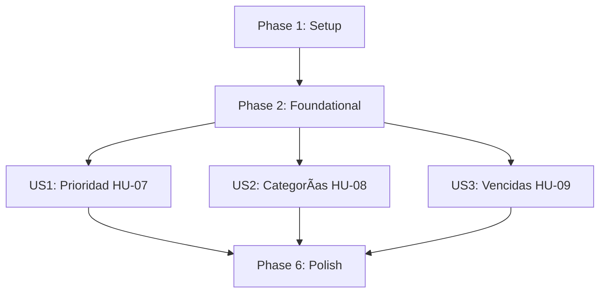

# Tasks: 003-task-organization-priority

**Feature**: Organización y priorización de tareas (HU-07, HU-08, HU-09)
**Entrada**: `spec.md`, `plan.md`, `data-model.md`, `contracts/category-contracts.md`, `contracts/task-priority-contracts.md`
**Prerrequisito**: Incrementos 1 y 2 implementados (incluye `is_deleted` / soft delete).

---

## Phase 1: Setup (Shared Infrastructure)

**Purpose**: Constantes de dominio y acciones de auditoría que consumen las tres historias.

- [X] T001 [P] Registrar constantes de acción `CATEGORY_CREATED`, `CATEGORY_UPDATED` y `CATEGORY_DELETED` en `src/taskcontrol/models/audit.py` por `data-model.md` §2.3
- [X] T002 [P] Definir constantes de prioridad (`high`, `medium`, `low`), su valor por defecto (`medium`) y su orden jerárquico en `src/taskcontrol/models/task.py`

---

## Phase 2: Foundational (Blocking Prerequisites)

**Purpose**: Esquema de datos. **BLOQUEA** las tres historias de usuario.

- [X] T003 Crear modelo `Category` en `src/taskcontrol/models/category.py` con `id (PK)`, `user_id (FK users.id, Not Null, index)`, `name (String(50), Not Null)`, `description (Text, Nullable)`, `color (String(7), Nullable)`, `created_at (DateTime UTC, Not Null)` y `UniqueConstraint('user_id','name', name='uq_user_category_name')` por `data-model.md` §2.1
- [X] T004 Extender modelo `Task` en `src/taskcontrol/models/task.py` con `priority (String(20), Not Null, default 'medium', index)` y `category_id (FK categories.id, ondelete='SET NULL', Nullable, index)` por `data-model.md` §2.2
- [X] T005 [P] Exponer `Category` en `src/taskcontrol/models/__init__.py`
- [X] T006 Crear migración Alembic en `migrations/versions/` añadiendo tabla `categories`, columnas `priority` (con `server_default='medium'`) y `category_id` a `tasks`, e índices correspondientes (Principio VI), sin romper las tareas existentes de los Incrementos 1 y 2

---

## Phase 3: User Story 1 - Prioridad de Tareas (HU-07) (Priority: P1) 🎯 MVP Core

### Tests for User Story 1 (Test-First bloqueante - Principio IV) ⚠️

- [X] T007 [P] [US1] Escribir pruebas de servicio en rojo para prioridad en `tests/services/test_task_service.py` (`test_task_created_with_default_medium_priority`, `test_update_task_priority_success`, `test_update_priority_rejects_invalid_value`, `test_cannot_update_priority_of_deleted_task`, `test_list_tasks_sorted_by_priority_desc`, `test_list_tasks_sorted_by_priority_asc`)
- [X] T008 [P] [US1] Escribir pruebas funcionales en rojo del endpoint de prioridad en `tests/functional/test_task_routes.py` (`test_update_priority_endpoint_success`, `test_update_priority_endpoint_invalid_value`, `test_update_priority_endpoint_not_found_for_other_user`, `test_list_tasks_sort_by_priority`)

### Implementation for User Story 1

- [X] T009 [US1] Implementar `update_task_priority(task_id, user_id, priority)` en `src/taskcontrol/services/task_service.py` validando el valor contra las prioridades permitidas, rechazando tareas eliminadas y auditando `TASK_UPDATED` (Principio VIII)
- [X] T010 [US1] Extender `get_user_tasks` en `src/taskcontrol/services/task_service.py` con el parámetro `sort` soportando `priority_desc`, `priority_asc`, `due_date` y `created_at` (por defecto), ordenando por jerarquía real y no alfabéticamente
- [X] T011 [US1] Implementar ruta `POST /tasks/<int:task_id>/priority` en `src/taskcontrol/routes/tasks.py` por `contracts/task-priority-contracts.md` §2
- [X] T012 [US1] Añadir selector de prioridad al formulario de creación y control de cambio en el listado en `src/taskcontrol/templates/tasks/index.html`, con indicador visual por nivel en `src/taskcontrol/static/css/styles.css`

---

## Phase 4: User Story 2 - Categorías (HU-08) (Priority: P1)

### Tests for User Story 2 (Test-First bloqueante - Principio IV) ⚠️

- [X] T013 [P] [US2] Escribir pruebas de servicio en rojo para categorías en `tests/services/test_category_service.py` (`test_create_category_success`, `test_create_category_rejects_duplicate_name_for_same_user`, `test_create_category_rejects_duplicate_name_ignoring_case`, `test_different_users_can_share_category_name`, `test_update_category_success`, `test_delete_category_unlinks_tasks_without_deleting_them`, `test_assign_category_to_task`, `test_cannot_assign_category_of_another_user`)
- [X] T014 [P] [US2] Escribir pruebas funcionales en rojo de los endpoints de categoría en `tests/functional/test_category_routes.py` (`test_list_categories_authenticated`, `test_create_category_endpoint_success`, `test_create_category_duplicate_returns_400`, `test_update_category_endpoint_success`, `test_delete_category_endpoint_unlinks_tasks`, `test_category_endpoints_require_session`)

### Implementation for User Story 2

- [X] T015 [US2] Crear `src/taskcontrol/services/category_service.py` con `create_category`, `get_user_categories` (incluyendo conteo de tareas activas), `update_category` y `delete_category` (desvincula fijando `category_id = NULL`, **nunca** borra tareas) y excepciones de dominio, auditando cada mutación (Principio VIII)
- [X] T016 [US2] Normalizar el nombre de categoría y verificar unicidad **ignorando mayúsculas/minúsculas** en `category_service.py`, porque la `UniqueConstraint` de SQLite distingue mayúsculas y por sí sola dejaría convivir "Trabajo" y "trabajo" (`spec.md` → Edge Cases)
- [X] T017 [US2] Implementar `assign_category_to_task(task_id, user_id, category_id)` en `src/taskcontrol/services/task_service.py` validando que tarea y categoría pertenezcan al usuario autenticado (prevención de IDOR, Principio VII) y aceptando `None` para desvincular
- [X] T018 [US2] Crear blueprint `categories_bp` en `src/taskcontrol/routes/categories.py` con `GET /categories`, `POST /categories`, `POST /categories/<int:category_id>/edit` y `POST /categories/<int:category_id>/delete`, y registrarlo en `src/taskcontrol/__init__.py`
- [X] T019 [US2] Implementar ruta `POST /tasks/<int:task_id>/category` en `src/taskcontrol/routes/tasks.py` por `contracts/task-priority-contracts.md` §3
- [X] T020 [US2] Extender `get_user_tasks` con filtrado por `category_id`, admitiendo el valor `none` para tareas sin categoría, sin romper el filtro por estado ya existente
- [X] T021 [P] [US2] Crear plantilla `src/taskcontrol/templates/categories/index.html` para listar, crear, editar y eliminar categorías, con confirmación que aclare que las tareas no se borran
- [X] T022 [US2] Mostrar la categoría de cada tarea y el filtro por categoría en `src/taskcontrol/templates/tasks/index.html`, y enlazar la sección de categorías desde la navegación en `src/taskcontrol/templates/base.html`
- [X] T023 [US2] Documentar el contrato de `POST /categories/<int:category_id>/edit` en `contracts/category-contracts.md` (ruta, método, payload, códigos de error), ausente pese a que FR-007 exige editar y `data-model.md` §2.3 define `CATEGORY_UPDATED`

---

## Phase 5: User Story 3 - Indicación de Tareas Vencidas (HU-09) (Priority: P2)

### Tests for User Story 3 (Test-First bloqueante - Principio IV) ⚠️

- [X] T024 [P] [US3] Escribir pruebas de servicio en rojo para vencimiento en `tests/services/test_task_service.py` (`test_task_with_past_due_date_is_overdue`, `test_completed_task_is_never_overdue`, `test_deleted_task_is_never_overdue`, `test_task_without_due_date_is_never_overdue`, `test_task_due_today_is_not_overdue`)
- [X] T025 [P] [US3] Escribir prueba funcional en rojo en `tests/functional/test_task_routes.py` verificando que `is_overdue` llega calculado en la respuesta del listado (`test_list_tasks_includes_is_overdue_flag`)

### Implementation for User Story 3

- [X] T026 [US3] Implementar la propiedad calculada `is_overdue` en `src/taskcontrol/models/task.py` — **no persistida** — retornando `True` solo si `due_date` es anterior a hoy, la tarea no está completada y no está eliminada (`data-model.md` §2.2)
- [X] T027 [US3] Incluir `is_overdue`, `priority` y `category` en `Task.to_dict()` por el contrato del listado, resolviendo el cálculo **exclusivamente en backend** y nunca en JavaScript (Principio III)
- [X] T028 [US3] Mostrar el distintivo visual de tarea vencida en `src/taskcontrol/templates/tasks/index.html` y `src/taskcontrol/static/css/styles.css`, consumiendo el valor que entrega el backend sin recalcular fechas en el cliente

---

## Phase 6: Polish & Cross-Cutting Concerns

- [X] T029 Ejecutar la suite completa con `pytest -v` garantizando cero regresiones frente a los Incrementos 1 y 2
- [X] T030 Validar los flujos de extremo a extremo según `specs/003-task-organization-priority/quickstart.md` contra el servidor real

---

## Dependencies & Execution Order

- **Setup (Phase 1)**: sin dependencias.
- **Foundational (Phase 2)**: depende de Phase 1. **BLOQUEA** las tres historias.
- **US1 (Phase 3 - HU-07)**: depende de Foundational.
- **US2 (Phase 4 - HU-08)**: depende de Foundational.
- **US3 (Phase 5 - HU-09)**: depende de Foundational. Independiente de US1 y US2 a nivel de dominio.
- **Polish (Phase 6)**: depende de la conclusión de US1, US2 y US3.

