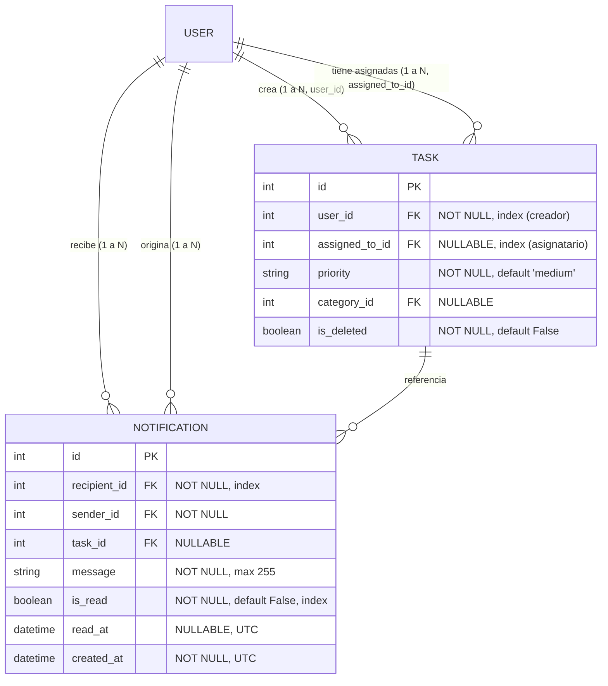
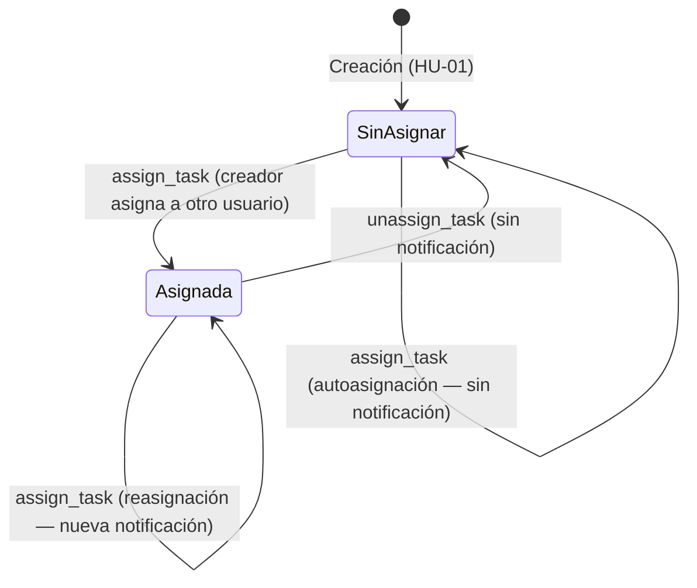

# Data Model: 004-user-collaboration

**Feature**: 004-user-collaboration
**Date**: 2026-10-06
**ORM**: SQLAlchemy

---

## 1. Diagrama Entidad-Relación

---

## 2. Entidades y Esquemas Detallados

### 2.1. Entidad `Task` (Extendida para Asignación)

Se mantiene la compatibilidad absoluta con los Incrementos 1-3, agregando una columna para delegación de trabajo:

| Campo | Tipo | Restricciones | Descripción |
|---|---|---|---|
| `assigned_to_id` | `Integer` | FK (`users.id`), Nullable, Index | Usuario al que se delegó la ejecución de la tarea |

**Reglas de negocio (`TaskService`)**:
- Solo el creador (`task.user_id == requesting_user_id`) puede asignar, reasignar o desasignar — verificado en backend en cada operación (Principio VII; Acceptance Scenario US1 #5).
- Al asignar: resolver `assigned_to_email` a un `user_id` existente (`AssigneeNotFoundError` si no existe — FR-002).
- Al asignar a un usuario distinto del creador: generar notificación. Al autoasignar (`assigned_to_id == user_id` del creador): omitir notificación (Edge Case "Autoasignación").
- Al desasignar: `assigned_to_id = NULL`, sin notificación (ver Clarifications, Session 2026-10-06, Q2).
- El listado (`get_user_tasks`) con `view='all'` (por defecto) incluye tareas donde el usuario es creador **o** asignatario; `view='created'` y `view='assigned'` filtran exclusivamente por cada rol.

---

### 2.2. Entidad `Notification` (Nueva)

Representa un aviso interno generado para un usuario ante un evento de asignación.

| Campo | Tipo | Restricciones | Descripción |
|---|---|---|---|
| `id` | `Integer` | PK, autoincrement | Identificador único de la notificación |
| `recipient_id` | `Integer` | FK (`users.id`), Not Null, Index | Usuario que recibe la notificación |
| `sender_id` | `Integer` | FK (`users.id`), Not Null | Usuario que originó el evento (el creador que asignó) |
| `task_id` | `Integer` | FK (`tasks.id`), Nullable | Tarea referenciada por el evento |
| `message` | `String(255)` | Not Null | Texto fijo construido y persistido al crear la notificación (ver Research §5) |
| `is_read` | `Boolean` | Not Null, Default `False`, Index | Estado de lectura |
| `read_at` | `DateTime` | Nullable, UTC | Momento en que se marcó como leída |
| `created_at` | `DateTime` | Not Null, Default UTC | Momento de creación |

**Reglas de validación y seguridad (`NotificationService`)**:
- Aislamiento estricto: ninguna operación de lectura o escritura puede afectar una notificación cuyo `recipient_id` no sea el usuario autenticado (FR-014; Cero IDOR).
- `mark_as_read` es idempotente: marcar una notificación ya leída no produce error ni sobrescribe `read_at` (Edge Case "Concurrencia en marcado de lectura").
- Las notificaciones **nunca** se eliminan tras su lectura (FR-013) — permanecen para consulta histórica.

---

### 2.3. Entidad `AuditLog` (Nuevas Acciones)

| Acción (`action`) | Entidad (`entity_id`) | Descripción del Evento |
|---|---|---|
| `TASK_ASSIGNED` | `task.id` | Tarea asignada o reasignada a un usuario (incluye autoasignación) |
| `TASK_UNASSIGNED` | `task.id` | Asignación retirada de una tarea |

---

## 3. Flujo de Asignación

