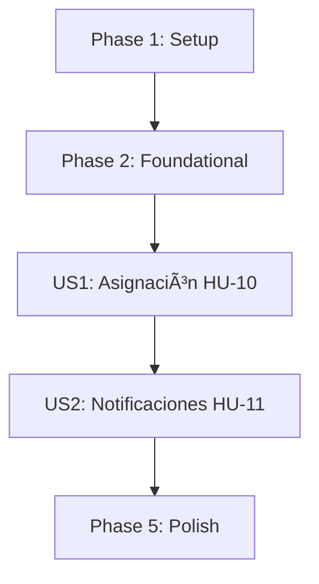

# Tasks: 004-user-collaboration

**Feature**: Colaboración entre usuarios (HU-10, HU-11)
**Entrada**: `spec.md`, `plan.md`, `contracts/assignment-contracts.md`, `contracts/notification-contracts.md`
**Prerrequisito**: Incrementos 1, 2 y 3 implementados.

---

## Phase 1: Setup (Shared Infrastructure)

- [X] T001 [P] Registrar las constantes de acción `TASK_ASSIGNED` y `TASK_UNASSIGNED` en `src/taskcontrol/models/audit.py` (FR-007)

---

## Phase 2: Foundational (Blocking Prerequisites)

**Purpose**: Esquema de datos. **BLOQUEA** ambas historias.

- [X] T002 Extender el modelo `Task` en `src/taskcontrol/models/task.py` con `assigned_to_id (FK users.id, ondelete='SET NULL', Nullable, Index)` y las relaciones `creator` y `assignee` con `foreign_keys` explícito (hay dos FK hacia `users`)
- [X] T003 Crear el modelo `Notification` en `src/taskcontrol/models/notification.py` con `id`, `recipient_id (FK, Not Null, Index)`, `sender_id (FK, Not Null)`, `task_id (FK, ondelete='SET NULL', Nullable)`, `message (String(255), Not Null)`, `is_read (Boolean, Not Null, default False, Index)`, `read_at (DateTime UTC, Nullable)` y `created_at (DateTime UTC, Not Null, Index)` por `plan.md` §2.2
- [X] T004 [P] Exponer `Notification` en `src/taskcontrol/models/__init__.py`
- [X] T005 Crear la migración Alembic añadiendo `tasks.assigned_to_id` y la tabla `notifications`, con **todas las claves foráneas nombradas** para que el `downgrade` funcione en SQLite (Principio VI)

---

## Phase 3: User Story 1 - Asignación de Tareas (HU-10) (Priority: P1) 🎯 MVP Core

### Tests for User Story 1 (Test-First bloqueante - Principio IV) ⚠️

- [X] T006 [P] [US1] Escribir pruebas de servicio en rojo en `tests/services/test_assignment_service.py` (`test_assign_task_to_existing_user`, `test_assign_to_unregistered_email_is_rejected_and_task_unchanged`, `test_only_creator_can_assign`, `test_unassign_task_sets_null_and_audits`, `test_reassignment_moves_task_between_assignees`, `test_assignee_sees_task_in_their_listing`, `test_cannot_assign_deleted_task`, `test_deleted_task_disappears_from_both_listings`)
- [X] T007 [P] [US1] Escribir pruebas funcionales en rojo en `tests/functional/test_assignment_routes.py` (`test_assign_endpoint_success`, `test_assign_endpoint_unregistered_email_returns_400`, `test_assign_endpoint_non_creator_returns_403`, `test_assign_endpoint_nonexistent_task_returns_404`, `test_list_tasks_scope_created_assigned_and_all`)

### Implementation for User Story 1

- [X] T008 [US1] Implementar `assign_task_to_user(task_id, actor_id, assignee_email)` en `src/taskcontrol/services/task_service.py`: resuelve el correo contra la base de datos, exige que el actor sea el creador, actualiza `assigned_to_id`, crea la notificación y audita `TASK_ASSIGNED` / `TASK_UNASSIGNED` **en una sola transacción** (`plan.md` §4, FR-001, FR-002, FR-003, FR-007)
- [X] T009 [US1] Definir la excepción `NotTaskOwnerError` en `task_service.py` para separar el 403 del 404 (`contracts/assignment-contracts.md` §1.1)
- [X] T010 [US1] Extender `get_user_tasks` con el parámetro `scope` (`all` | `created` | `assigned`), incluyendo por defecto las tareas asignadas al usuario además de las propias, sin romper los filtros de estado, categoría y orden del Incremento 3 (FR-004, FR-006)
- [X] T011 [US1] Incluir `assigned_to_id`, `assignee_email`, `creator_email`, `is_mine` e `is_assigned_to_me` en la serialización de la tarea, resolviendo la autoría en backend (FR-005)
- [X] T012 [US1] Implementar la ruta `POST /tasks/<int:task_id>/assign` en `src/taskcontrol/routes/tasks.py` por el contrato, devolviendo 400 / 403 / 404 según corresponda
- [X] T013 [US1] Añadir al listado `src/taskcontrol/templates/tasks/index.html` las pestañas "Todas" / "Creadas por mí" / "Asignadas a mí", los distintivos de autoría y el formulario de asignación por correo (FR-005, FR-006)

---

## Phase 4: User Story 2 - Notificaciones Internas (HU-11) (Priority: P1)

### Tests for User Story 2 (Test-First bloqueante - Principio IV) ⚠️

- [X] T014 [P] [US2] Escribir pruebas de servicio en rojo en `tests/services/test_notification_service.py` (`test_assignment_creates_exactly_one_notification`, `test_self_assignment_creates_no_notification`, `test_mark_as_read_is_idempotent_and_keeps_read_at`, `test_read_notification_is_not_deleted`, `test_mark_all_as_read`, `test_cannot_read_notification_of_another_user`, `test_unread_count_per_user`)
- [X] T015 [P] [US2] Escribir pruebas funcionales en rojo en `tests/functional/test_notification_routes.py` (`test_list_notifications_authenticated`, `test_notifications_require_session`, `test_mark_notification_read_endpoint`, `test_mark_all_read_endpoint`, `test_cannot_mark_notification_of_another_user`)

### Implementation for User Story 2

- [X] T016 [US2] Crear `src/taskcontrol/services/notification_service.py` con `create_assignment_notification`, `get_user_notifications`, `unread_count`, `mark_as_read` (idempotente) y `mark_all_as_read` (atómico), filtrando **siempre** por `recipient_id` (FR-008, FR-010, FR-012, FR-014)
- [X] T017 [US2] Persistir el `message` ya redactado en el momento de la asignación, para que la notificación conserve su sentido si la tarea se elimina después (`plan.md` §2.2)
- [X] T018 [US2] Crear el blueprint `notifications_bp` en `src/taskcontrol/routes/notifications.py` con `GET /notifications`, `POST /notifications/<id>/read` y `POST /notifications/read-all`, y registrarlo en `src/taskcontrol/__init__.py`
- [X] T019 [US2] Exponer el contador de no leídas a todas las plantillas mediante un context processor en `src/taskcontrol/__init__.py`, devolviendo `0` sin sesión activa (FR-011)
- [X] T020 [P] [US2] Crear la plantilla `src/taskcontrol/templates/notifications/index.html` con el listado, el botón de marcar individual y el de marcar todas
- [X] T021 [US2] Añadir el enlace a notificaciones con su contador en `src/taskcontrol/templates/base.html` y su estilo en `src/taskcontrol/static/css/styles.css`

---

---

## Ambigüedad detectada en el análisis cruzado ⚠️

**FR-004 dice que el asignatario puede "interactuar" con la tarea "según las reglas de negocio", pero no define cuáles son esas reglas.** La spec no aclara si quien recibe una tarea puede cambiar su estado, editarla o eliminarla, o si solo puede verla.

Lo que sí está definido:
- Los escenarios de aceptación de la Historia 1 solo exigen que el asignatario **vea** la tarea en su listado.
- El escenario 5 reserva explícitamente la **reasignación** al creador.
- Ninguna historia menciona que el asignatario pueda editar, eliminar ni cambiar el estado.

**Decisión tomada**: se implementa la **visibilidad**, que es lo único que la especificación exige sin ambigüedad. Las mutaciones (estado, prioridad, categoría, edición, borrado) siguen restringidas al creador, como en los Incrementos 1 a 3.

**Motivo**: conceder permisos de escritura al asignatario cambiaría el modelo de autorización de todos los endpoints anteriores y debilitaría el Principio VII basándose en una frase ambigua. Es más barato ampliarlo después, si el equipo lo confirma, que revertir una apertura de permisos ya desplegada.

**Pendiente de confirmar con el equipo**: si se espera que el asignatario pueda al menos cambiar el estado de la tarea delegada, hace falta una aclaración de la spec y un incremento de alcance.

---

## Phase 5: Polish & Cross-Cutting Concerns

- [X] T022 Ejecutar la suite completa con `pytest -v` garantizando cero regresiones frente a los Incrementos 1, 2 y 3
- [X] T023 Validar los flujos de extremo a extremo contra el servidor real: asignación entre dos usuarios, aparición en "Asignadas a mí", notificación recibida y marcado de lectura

---

## Dependencies & Execution Order

- **Setup (Phase 1)**: sin dependencias.
- **Foundational (Phase 2)**: depende de Phase 1. **BLOQUEA** ambas historias.
- **US1 (Phase 3 - HU-10)**: depende de Foundational.
- **US2 (Phase 4 - HU-11)**: depende de Foundational **y de US1**, porque la notificación se crea dentro del flujo de asignación.
- **Polish (Phase 5)**: depende de US1 y US2.

