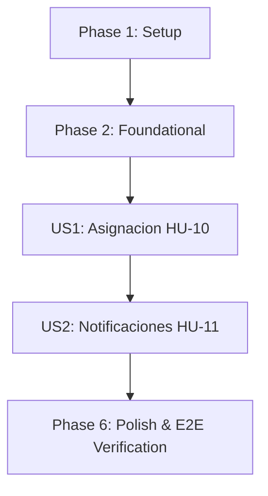

# Tasks: 004-user-collaboration

**Feature**: 004-user-collaboration (Colaboración entre usuarios)
**Spec**: [spec.md](spec.md) | **Plan**: [plan.md](plan.md)
**Date**: 2026-10-06
**Status**: Ready for Implementation

---

## Phase 1: Setup (Shared Infrastructure)

**Purpose**: Sincronización del entorno y ampliación de constantes de auditoría para asignación de tareas.

- [X] T001 Synchronize development environment and verify baseline test suite in `tests/` with `pytest` (debe mostrar las 100 pruebas de los Incrementos 1-3 en verde)
- [X] T002 [P] Register new audit action constants (`TASK_ASSIGNED`, `TASK_UNASSIGNED`) in `src/taskcontrol/models/audit.py` per `specs/004-user-collaboration/data-model.md`

---

## Phase 2: Foundational (Blocking Prerequisites)

**Purpose**: Infraestructura de datos bloqueante: extensión de `Task` para asignación, nuevo modelo `Notification`, migraciones y excepciones de dominio.

**⚠️ CRITICAL**: Ninguna historia de usuario puede implementarse hasta completar esta fase.

- [X] T003 Extend `Task` model in `src/taskcontrol/models/task.py` with column `assigned_to_id (FK users.id, Nullable, index)` y relación `assignee = db.relationship('User', foreign_keys=[assigned_to_id])` (explícito para evitar ambigüedad con la FK existente `user_id`, ver `specs/004-user-collaboration/research.md` §4). **Nota post-implementación**: también fue necesario agregar `foreign_keys="Task.user_id"` al backref existente `User.tasks` en `models/user.py` — SQLAlchemy lo exige en cuanto aparece una segunda FK de `Task` hacia `users`, algo que `research.md` no había anticipado (delatado por la suite completa, no por revisión manual).
- [X] T004 [P] Create `Notification` model in `src/taskcontrol/models/notification.py` with columns `id (PK, Integer)`, `recipient_id (FK users.id, Not Null, index)`, `sender_id (FK users.id, Not Null)`, `task_id (FK tasks.id, Nullable)`, `message (String(255), Not Null)`, `is_read (Boolean, Not Null, default False, index)`, `read_at (DateTime, Nullable, UTC)`, `created_at (DateTime, Not Null, default UTC)` per `specs/004-user-collaboration/data-model.md`
- [X] T005 Expose `Notification` in `src/taskcontrol/models/__init__.py`, y generar + aplicar migración en `migrations/versions/` agregando `tasks.assigned_to_id` (nullable, compatibilidad retroactiva con tareas de Incrementos 1-3) y la tabla `notifications` per Principle VI
- [X] T006 [P] Define domain exceptions (`AssigneeNotFoundError`) in `src/taskcontrol/services/task_service.py` y crear `src/taskcontrol/services/notification_service.py` con `NotificationNotFoundError`

**Checkpoint**: Base de datos y modelos listos con compatibilidad retrospectiva. Las historias de usuario pueden comenzar.

---

## Phase 3: User Story 1 - Asignación Segura de Tareas entre Usuarios (HU-10) (Priority: P1) 🎯 MVP Core

**Goal**: Permitir a un creador asignar/reasignar/desasignar una tarea propia a otro usuario identificado por correo electrónico, visible en el listado del asignatario, con auditoría completa.

**Independent Test**: Crear una tarea con el Usuario A, asignarla al Usuario B por correo, verificar que B la vea en su listado ("Asignadas a mí") y que `TASK_ASSIGNED` quede auditado; desasignarla y verificar que B deja de verla.

### Tests for User Story 1 (Test-First bloqueante - Principio IV) ⚠️
> **NOTA: Escribir estas pruebas primero y verificar que FALLAN antes de implementar el código**

- [X] T007 [P] [US1] Write failing service tests in `tests/services/test_task_service.py` (`test_assign_task_success_creates_notification_and_audit_log`, `test_assign_task_to_nonexistent_email_rejected`, `test_only_creator_can_assign_task`, `test_self_assignment_succeeds_without_notification`, `test_unassign_task_success_no_notification_generated`, `test_assigned_task_visible_in_assignee_task_list`, `test_get_user_tasks_view_created_vs_assigned_vs_all`, `test_reassignment_notifies_new_assignee_and_old_assignee_loses_access`, `test_assignee_can_update_task_status`, `test_assignee_cannot_edit_delete_priority_category_or_reassign_task` — estas 2 últimas cubren el hallazgo E1 de `/speckit-analyze`: el asignatario solo puede cambiar el estado, nada más)
- [X] T008 [P] [US1] Write failing functional tests in `tests/functional/test_task_routes.py` (`POST /tasks/<id>/assign` → 200/400/404 ASSIGNEE_NOT_FOUND/404 TASK_NOT_FOUND (tarea ajena)/401; `POST /tasks/<id>/unassign` → 200/404/401; `GET /tasks?view=assigned|created|all`)

### Implementation for User Story 1
- [X] T009 [US1] Implement `assign_task(task_id, user_id, assigned_to_email)` in `src/taskcontrol/services/task_service.py`: verifica que `user_id` sea el creador (reutiliza patrón de búsqueda por creador, NO `get_user_tasks` ampliado), resuelve el correo contra `User` (`AssigneeNotFoundError` si no existe), actualiza `assigned_to_id`, audita `TASK_ASSIGNED`, e invoca `NotificationService.create_notification` solo si `assigned_to_id != user_id` (sin notificación en autoasignación, Edge Case) (make service tests pass)
- [X] T010 [US1] Implement `unassign_task(task_id, user_id)` in `src/taskcontrol/services/task_service.py`: mismo control de creador, `assigned_to_id = None`, audita `TASK_UNASSIGNED`, **nunca** invoca `NotificationService` (ver spec Clarifications, Session 2026-10-06, Q2) (make service tests pass)
- [X] T011 [US1] Extend `get_user_tasks` in `src/taskcontrol/services/task_service.py` con parámetro `view` (`'all'` default: `user_id == user_id OR assigned_to_id == user_id`; `'created'`: solo `user_id`; `'assigned'`: solo `assigned_to_id`) per `specs/004-user-collaboration/contracts/assignment-contracts.md`
- [X] T012 [US1] Add `assigned_to` (objeto `{id, email}` o `null`) e `is_owner` (booleano) a `Task.to_dict()` in `src/taskcontrol/models/task.py`
- [X] T012b [US1] Modify `update_task_status` in `src/taskcontrol/services/task_service.py` para autorizar tanto al creador como al asignatario (`Task.user_id == user_id OR Task.assigned_to_id == user_id`), **sin** tocar la autorización de `update_task_details`, `update_task_priority`, `delete_task` ni `assign_category`, que siguen siendo exclusivas del creador vía `get_task_by_id` — resuelve el hallazgo E1 de `/speckit-analyze` (make `test_assignee_can_update_task_status` / `test_assignee_cannot_edit_delete_priority_category_or_reassign_task` pass)
- [X] T013 [US1] Implement `POST /tasks/<int:task_id>/assign` y `POST /tasks/<int:task_id>/unassign` route handlers in `src/taskcontrol/routes/tasks.py` con `@login_required` per `specs/004-user-collaboration/contracts/assignment-contracts.md` (make functional tests pass)
- [X] T014 [US1] Extend `GET /tasks` route in `src/taskcontrol/routes/tasks.py` to accept el query param `view` y pasarlo a `TaskService.get_user_tasks`
- [X] T015 [US1] Add pestañas "Todas"/"Creadas por mí"/"Asignadas a mí", formulario de asignación por correo, badge "Asignada por [correo]" / "Creada por mí", y acciones de estado visibles para el asignatario (pero no las de editar/eliminar/prioridad/categoría) en `src/taskcontrol/templates/tasks/index.html`

**Checkpoint**: User Story 1 (HU-10) completamente operativa y verificada con pruebas automatizadas.

---

## Phase 4: User Story 2 - Notificaciones Internas de Asignación (HU-11) (Priority: P1)

**Goal**: Generar y exponer notificaciones internas persistidas ante cada asignación a un tercero, consultables y marcables como leídas (individual o en bloque), sin descartarse tras la lectura.

**Independent Test**: Asignar una tarea al Usuario B; como B, ver el contador de no leídas, consultar `/notifications`, marcarla como leída y verificar que el contador decrementa y la notificación permanece en el historial.

### Tests for User Story 2 (Test-First bloqueante - Principio IV) ⚠️
- [X] T016 [P] [US2] Write failing service tests in `tests/services/test_notification_service.py` (nuevo archivo) (`test_create_notification_persists_and_links_task`, `test_notification_isolation_between_users`, `test_mark_notification_as_read_updates_is_read_and_read_at`, `test_mark_notification_as_read_is_idempotent`, `test_mark_all_as_read_updates_all_pending_atomically`, `test_unread_count_reflects_pending_notifications`, `test_read_notification_remains_in_history` — hallazgo M1 de `/speckit-analyze`, `test_notification_survives_soft_deleted_task` — hallazgo M2 de `/speckit-analyze`)
- [X] T017 [P] [US2] Write failing functional tests in `tests/functional/test_notification_routes.py` (nuevo archivo) (`GET /notifications` incluye `unread_count`; `POST /notifications/<id>/read` → 200/404; `POST /notifications/mark-all-read` → 200; 401 sin sesión en todos)

### Implementation for User Story 2
- [X] T018 [US2] Implement `NotificationService.create_notification(recipient_id, sender_id, task, )` (construye `message` denormalizado, ver `specs/004-user-collaboration/research.md` §5), `list_user_notifications(user_id)` (orden `created_at.desc()`) y `get_unread_count(user_id)` in `src/taskcontrol/services/notification_service.py` (make service tests pass)
- [X] T019 [US2] Implement `NotificationService.mark_as_read(notification_id, user_id)` (idempotente; `NotificationNotFoundError` si no pertenece al usuario) y `mark_all_as_read(user_id)` (`UPDATE` atómico) in `src/taskcontrol/services/notification_service.py` (make service tests pass)
- [X] T020 [US2] Implement `notifications_bp` blueprint in `src/taskcontrol/routes/notifications.py` (`GET /notifications`, `POST /notifications/<int:notification_id>/read`, `POST /notifications/mark-all-read`) con `@login_required`, y registrarlo en `src/taskcontrol/__init__.py` con `url_prefix='/notifications'` per `specs/004-user-collaboration/contracts/notification-contracts.md` (make functional tests pass)
- [X] T021 [US2] Add contador de notificaciones no leídas en la barra de navegación en `src/taskcontrol/templates/base.html`
- [X] T022 [US2] Create `src/taskcontrol/templates/notifications/index.html` con listado cronológico, acción "Marcar como leída" por ítem y "Marcar todas como leídas"

**Checkpoint**: Flujo de colaboración (HU-10, HU-11) completado sin regresión sobre las 100 pruebas de los Incrementos 1-3.

---

## Phase 6: Polish & Cross-Cutting Concerns

**Purpose**: Verificación integral de calidad y suite completa sin regresiones.

- [X] T023 [P] Add confirmación (`data-confirm`) para la acción de desasignar en `src/taskcontrol/templates/tasks/index.html`, siguiendo el patrón ya usado para eliminar/reabrir
- [X] T024 Execute full test suite `pytest -v` across all service and functional tests ensuring 100% pass rate
- [X] T025 Validate end-to-end user workflows following `specs/004-user-collaboration/quickstart.md` ensuring zero regression against Increments 1-3 features

---

## Dependencies & Execution Order

### Phase Dependencies

- **Setup (Phase 1)**: Sin dependencias, arranca de inmediato.
- **Foundational (Phase 2)**: Depende de Phase 1. **BLOQUEA** todas las historias de usuario.
- **User Story 1 (Phase 3 - HU-10)**: Depende de Foundational (Phase 2).
- **User Story 2 (Phase 4 - HU-11)**: Depende de Foundational (Phase 2) y de T009 de US1 (la notificación se crea *dentro* de `assign_task`) — no es independiente a nivel de servicio, aunque sí lo es a nivel de pruebas de `NotificationService` en aislamiento.
- **Polish (Phase 6)**: Depende de la conclusión de US1 y US2.

### User Story Execution Graph

### Reglas de Ejecución Dentro de Cada Historia
1. Escribir pruebas unitarias y de servicio (en rojo) antes de implementar lógica de dominio.
2. Escribir pruebas funcionales de endpoints (en rojo) antes de crear rutas HTTP.
3. Servicios de dominio antes de blueprints HTTP.
4. Blueprints HTTP antes de plantillas Jinja2 / frontend.

---

## Parallel Opportunities

- **Setup Tasks**: T001 y T002 pueden ejecutarse en paralelo.
- **Foundational Tasks**: T004 y T006 pueden ejecutarse en paralelo con T003.
- **Pruebas por Historia**: T007 y T008 (US1), T016 y T017 (US2) pueden escribirse en paralelo.

---

## Implementation Strategy

### MVP First (User Story 1: Asignación)
1. Completar Setup (Fase 1) y Foundational (Fase 2: modelos, migración, excepciones).
2. Implementar US1 (Asignación HU-10) con ciclo test-first.
3. **Validar MVP del Incremento 4**: una tarea asignada es visible para su asignatario y auditada.

### Entrega Incremental
1. Añadir US2 (Notificaciones HU-11) sobre la asignación ya funcional.
2. Ejecutar Fase 6 (Polish & E2E) con `pytest -v` garantizando cero regresión sobre las 100 pruebas de los Incrementos 1-3.
