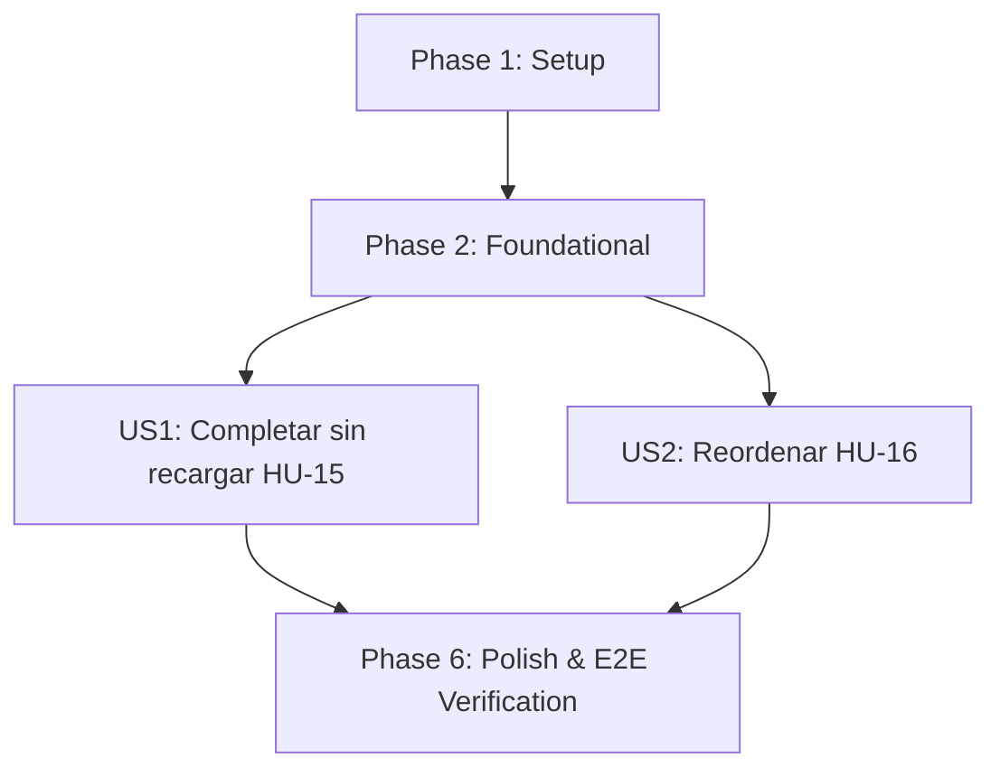

# Tasks: 005-frontend-interaction

**Feature**: 005-frontend-interaction (Interfaz e interacción — JavaScript)
**Spec**: [spec.md](spec.md) | **Plan**: [plan.md](plan.md)
**Date**: 2026-10-07
**Status**: Ready for Implementation

---

## Phase 1: Setup

**Purpose**: Sincronización del entorno antes de tocar nada.

- [X] T001 Synchronize development environment and verify baseline test suite in `tests/` with `pytest` (debe mostrar las 130 pruebas de los Incrementos 1-4 en verde)

---

## Phase 2: Foundational (Blocking Prerequisites)

**Purpose**: Columna de orden persistente y migración con backfill determinista. Ningún endpoint ni interacción de usuario puede implementarse hasta completar esta fase.

**⚠️ CRITICAL**: Ninguna historia de usuario puede implementarse hasta completar esta fase.

- [X] T002 Extend `Task` model in `src/taskcontrol/models/task.py` with column `manual_order (Integer, Not Null, default 0, index)` per `specs/005-frontend-interaction/data-model.md`
- [X] T003 Implement `TaskService.backfill_manual_order()` in `src/taskcontrol/services/task_service.py` (asigna `manual_order` secuencial por usuario siguiendo `created_at` descendente, per `specs/005-frontend-interaction/research.md` §5) y generar + aplicar migración en `migrations/versions/` que agregue la columna y lo invoque per Principle VI

**Checkpoint**: Columna de orden lista y con backfill coherente. Las historias de usuario pueden comenzar.

---

## Phase 3: User Story 1 - Completar Tareas sin Recargar la Página (HU-15) (Priority: P1) 🎯 MVP Core

**Goal**: Marcar una tarea como completada desde el listado sin recargar la página, con reversión visual ante cualquier fallo del backend.

**Independent Test**: Completar una tarea y verificar que el cambio se vea sin recarga; simular un fallo de red y verificar que la interfaz revierta el cambio y muestre un error (quickstart Escenario A).

> **Nota (Principio IV)**: Esta historia no introduce lógica de dominio nueva — reutiliza exclusivamente `POST /tasks/<id>/status` ya probado en el Incremento 1. No hay tareas de prueba automatizada; la verificación es manual (quickstart Escenario A), tal como lo documenta `plan.md` §6.

### Implementation for User Story 1
- [X] T004 [US1] Implement optimistic fetch-based completion in `src/taskcontrol/static/js/main.js`: interceptar el `submit` del formulario de "Completar" existente en `src/taskcontrol/templates/tasks/index.html`, actualizar el badge de estado de forma optimista, deshabilitar el botón durante la petición, y revertir el cambio visual + mostrar mensaje de error si la petición falla. En éxito, además de confirmar el badge, actualizar cuáles acciones quedan visibles en la tarjeta (ocultar Iniciar/Pausar/Completar, mostrar Reabrir) para que no queden botones de una transición ya inválida — hallazgo U1 de `/speckit-analyze`, per `specs/005-frontend-interaction/plan.md` §1

**Checkpoint**: User Story 1 (HU-15) verificada manualmente per quickstart Escenario A.

---

## Phase 4: User Story 2 - Reordenar Tareas Arrastrándolas (HU-16) (Priority: P2)

**Goal**: Permitir reordenar visualmente las tareas (propias o asignadas) mediante arrastrar y soltar, solo en modo de orden manual explícito, persistiendo el nuevo orden de forma atómica y autorizada.

**Independent Test**: Seleccionar el modo de orden manual, arrastrar una tarea a una nueva posición, recargar la página y verificar que el orden se mantuvo (quickstart Escenario B).

### Tests for User Story 2 (Test-First bloqueante - Principio IV) ⚠️
> **NOTA: Escribir estas pruebas primero y verificar que FALLAN antes de implementar el código**

- [X] T005 [P] [US2] Write failing service tests in `tests/services/test_task_service.py` (`test_reorder_tasks_persists_new_order_for_all_affected_tasks`, `test_reorder_rejects_task_not_owned_or_assigned`, `test_reorder_is_atomic_all_or_nothing`, `test_get_user_tasks_sort_manual_respects_persisted_order`, `test_assignee_can_reorder_assigned_task`, `test_backfill_manual_order_follows_created_at_per_user`)
- [X] T006 [P] [US2] Write failing functional tests in `tests/functional/test_task_routes.py` (`POST /tasks/reorder` → 200/400 VALIDATION_ERROR/404 TASK_NOT_FOUND (lote abortado completo)/401; `GET /tasks?sort=manual` retorna el orden persistido)

### Implementation for User Story 2
- [X] T007 [US2] Implement `TaskService.reorder_tasks(user_id, task_ids: list)` in `src/taskcontrol/services/task_service.py`: autoriza cada `task_id` reutilizando `_get_task_for_creator_or_assignee` (Incremento 4, Clarifications Q3), aborta el lote completo sin persistir nada si alguno falla, y asigna `manual_order` secuencial según la posición en la lista, en una única transacción (make service tests pass)
- [X] T008 [US2] Extend `get_user_tasks` in `src/taskcontrol/services/task_service.py` con el valor `sort='manual'` que ordena por `Task.manual_order.asc()` per `specs/005-frontend-interaction/contracts/reorder-contracts.md`
- [X] T009 [US2] Implement `POST /tasks/reorder` route handler in `src/taskcontrol/routes/tasks.py` con `@login_required` per `specs/005-frontend-interaction/contracts/reorder-contracts.md` (make functional tests pass)
- [X] T010 [US2] Add opción de orden "Manual" en los controles de ordenamiento, atributos `draggable` condicionales a `current_sort == 'manual'`, e identificador `data-task-id` por tarjeta en `src/taskcontrol/templates/tasks/index.html`
- [X] T011 [US2] Implement native Drag and Drop API handlers (`dragstart`, `dragover`, `drop`) in `src/taskcontrol/static/js/main.js`: recalcula el arreglo de `task_id` en el nuevo orden visual tras soltar, lo envía a `POST /tasks/reorder`, y bloquea nuevas interacciones de arrastre mientras la petición está en curso, per `specs/005-frontend-interaction/plan.md` §2 y §4

**Checkpoint**: User Story 2 (HU-16) completamente funcional, verificada con pruebas automatizadas de servicio/ruta y manualmente per quickstart Escenario B.

---

## Phase 6: Polish & Cross-Cutting Concerns

**Purpose**: Verificación integral de calidad y suite completa sin regresiones.

- [X] T012 Execute full test suite `pytest -v` ensuring 100% pass rate (backend únicamente — no hay pruebas automatizadas de JavaScript en este proyecto)
- [X] T013 Validate end-to-end user workflows following `specs/005-frontend-interaction/quickstart.md` (Escenarios A y B) ensuring zero regression against Increments 1-4 features

---

## Dependencies & Execution Order

### Phase Dependencies

- **Setup (Phase 1)**: Sin dependencias.
- **Foundational (Phase 2)**: Depende de Phase 1. **BLOQUEA** ambas historias.
- **User Story 1 (Phase 3 - HU-15)**: Depende de Foundational. Independiente de US2 — no toca `manual_order` ni el endpoint nuevo.
- **User Story 2 (Phase 4 - HU-16)**: Depende de Foundational (columna y backfill).
- **Polish (Phase 6)**: Depende de la conclusión de US1 y US2.

### User Story Execution Graph

---

## Parallel Opportunities

- **Pruebas de US2**: T005 y T006 pueden escribirse en paralelo.
- **Historias de Usuario**: US1 y US2 son independientes entre sí (ninguna depende de los archivos que la otra modifica, salvo ambas tocar `main.js` — se recomienda completar US1 antes de US2 para minimizar conflictos de merge en ese único archivo).

---

## Implementation Strategy

### MVP First (User Story 1: Completar sin recargar)
1. Completar Setup (Fase 1) y Foundational (Fase 2: columna + backfill).
2. Implementar US1 (HU-15) — la interacción más frecuente, sin cambios de backend.
3. **Validar MVP del Incremento 5**: completar tareas sin recarga, con reversión visual verificada manualmente.

### Entrega Incremental
1. Añadir US2 (HU-16) con ciclo test-first a nivel de servicio/ruta.
2. Ejecutar Fase 6 (Polish & E2E) con `pytest -v` y la verificación manual de ambos escenarios, garantizando cero regresión sobre las 130 pruebas de los Incrementos 1-4.

Con este incremento se completan las 16 historias de usuario del backlog de TaskControl.
