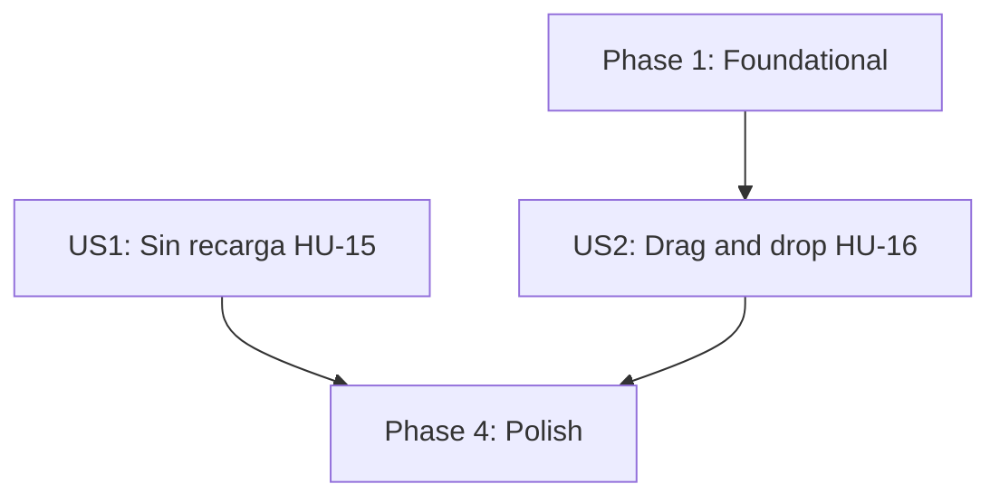

# Tasks: 005-ui-interaction

**Feature**: Interfaz e interacción con JavaScript (HU-15, HU-16)
**Entrada**: `spec.md`, `plan.md`, `contracts/reorder-contracts.md`
**Prerrequisito**: Incrementos 1 a 4 implementados.

---

## Phase 1: Foundational (Blocking Prerequisites)

**Purpose**: El único cambio de esquema del incremento. **BLOQUEA** la Historia 2.

- [X] T001 Añadir el campo `position (Integer, Not Null, default 0, Index)` al modelo `Task` en `src/taskcontrol/models/task.py` e incluirlo en `to_dict()` (`plan.md` §3.1, FR-009)
- [X] T002 Crear la migración Alembic que añade `tasks.position` con `server_default='0'` y su índice, con la clave de desempate preservando el orden actual de las tareas preexistentes (Principio VI, FR-011)

---

## Phase 2: User Story 1 - Completar sin Recargar (HU-15) (Priority: P1) 🎯 MVP Core

**No requiere cambios de backend**: consume el endpoint de cambio de estado del Incremento 1 (FR-002).

### Tests for User Story 1 ⚠️

- [X] T003 [P] [US1] Verificar con prueba funcional en `tests/functional/test_task_routes.py` que `POST /tasks/<id>/status` responde JSON válido ante `Accept: application/json`, que es el contrato del que depende el JavaScript (`test_status_endpoint_returns_json_for_fetch`), y que un error devuelve un código distinto de 2xx para que el cliente pueda revertir (`test_status_endpoint_invalid_transition_returns_error_for_fetch`)

### Implementation for User Story 1

- [X] T004 [US1] Implementar en `src/taskcontrol/static/js/main.js` la interceptación del envío de los formularios de cambio de estado, usando `fetch` contra el endpoint existente, con cambio visual optimista (`plan.md` §1, FR-001)
- [X] T005 [US1] Implementar la **reversión del estado visual** ante fallo de red o respuesta de error, restaurando el distintivo exacto anterior y mostrando un mensaje al usuario (FR-003, SC-002)
- [X] T006 [US1] Garantizar la mejora progresiva: sin JavaScript los formularios se envían de la forma tradicional y la operación funciona con recarga (FR-005, SC-006)
- [X] T007 [US1] Añadir en `src/taskcontrol/templates/tasks/index.html` los atributos de datos que el script necesita para localizar la tarjeta y el distintivo de cada tarea, sin romper el funcionamiento sin JavaScript

---

## Phase 3: User Story 2 - Reordenar Arrastrando (HU-16) (Priority: P2)

### Tests for User Story 2 (Test-First bloqueante - Principio IV) ⚠️

- [X] T008 [P] [US2] Escribir pruebas de servicio en rojo en `tests/services/test_reorder_service.py` (`test_reorder_persists_new_positions`, `test_reorder_preserves_order_across_queries`, `test_reorder_ignores_tasks_of_other_users`, `test_reorder_ignores_nonexistent_and_deleted_ids`, `test_preexisting_tasks_keep_relative_order_by_default`)
- [X] T009 [P] [US2] Escribir pruebas funcionales en rojo en `tests/functional/test_reorder_routes.py` (`test_reorder_endpoint_success`, `test_reorder_endpoint_requires_session`, `test_reorder_endpoint_invalid_payload_returns_400`, `test_reorder_endpoint_reports_ignored_ids`, `test_list_tasks_respects_personal_order`)

### Implementation for User Story 2

- [X] T010 [US2] Implementar `reorder_user_tasks(user_id, task_ids)` en `src/taskcontrol/services/task_service.py`, filtrando los identificadores contra las tareas del usuario **antes** de escribir, reasignando posiciones consecutivas y devolviendo los ignorados (FR-010, Principio VII)
- [X] T011 [US2] Cambiar el orden por defecto de `get_user_tasks` a `position ASC, created_at DESC`, manteniendo la precedencia de los ordenamientos explícitos del Incremento 3 (`plan.md` §3.3)
- [X] T012 [US2] Implementar la ruta `POST /tasks/reorder` en `src/taskcontrol/routes/tasks.py` por `contracts/reorder-contracts.md`
- [X] T013 [US2] Implementar en `main.js` el arrastrar y soltar con la API nativa del navegador, persistiendo el nuevo orden al soltar y revirtiendo el orden visual si el backend falla (FR-006, FR-007, Escenario 3)
- [X] T014 [US2] Ofrecer el reordenamiento **solo** cuando no hay un `sort` explícito activo, para no presentar dos criterios de orden contradictorios (FR-012)
- [X] T015 [US2] Evitar la petición al backend cuando la tarea se suelta en la misma posición en la que estaba (Edge Case de doble envío)
- [X] T016 [P] [US2] Añadir en `src/taskcontrol/static/css/styles.css` los estilos del arrastre (elemento tomado y zona de destino)

---

## Phase 4: Polish & Cross-Cutting Concerns

- [X] T017 Ejecutar la suite completa con `pytest -v` garantizando cero regresiones frente a los Incrementos 1 a 4
- [X] T018 Escribir `specs/005-ui-interaction/quickstart.md` con el procedimiento **manual** de verificación de la capa JavaScript, declarando explícitamente que el proyecto no tiene infraestructura de pruebas de frontend (`plan.md` §6)
- [X] T019 Validar contra el servidor real: persistencia del orden tras recarga y comportamiento del listado con y sin ordenamiento explícito

---

## Nota sobre la cobertura de pruebas ⚠️

**El proyecto no tiene infraestructura de pruebas de frontend** — no hay Jest, Vitest ni Playwright, y `requirements.txt` es exclusivamente Python. Montarla implicaría introducir un ecosistema de Node completo en un proyecto que hasta ahora no lo necesita, lo cual excede el alcance de este incremento.

**Consecuencia declarada explícitamente**: dos comportamientos de HU-15 y HU-16 se verifican **a mano** y no quedan cubiertos por `pytest`:

1. Que un error del backend revierta el estado visual (FR-003).
2. Que el arrastre reordene visualmente (FR-006).

Las pruebas automatizadas sí cubren todo el contrato de backend —persistencia del orden, aislamiento entre usuarios, manejo de identificadores inválidos—, que es donde reside el riesgo de pérdida o corrupción de datos. El procedimiento manual queda en `quickstart.md`.

---

## Dependencies & Execution Order

- **Foundational (Phase 1)**: **BLOQUEA** la Historia 2. La Historia 1 no depende de ella.
- **US1 (Phase 2 - HU-15)**: independiente; no toca el backend.
- **US2 (Phase 3 - HU-16)**: depende de Foundational.
- **Polish (Phase 4)**: depende de US1 y US2.

